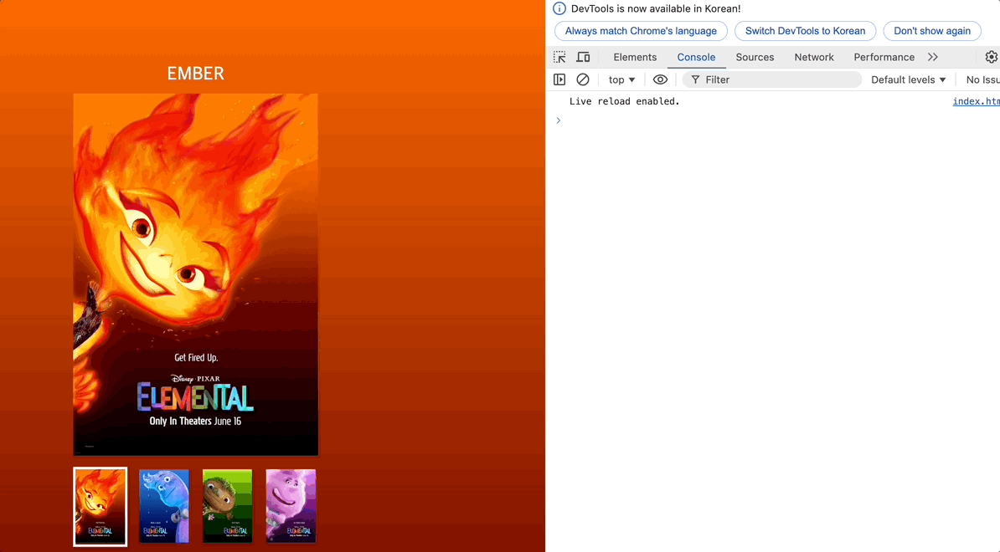

# 3주차 과제

## 과제 목표

1. 이벤트 위임을 사용하여 내부 요소에 이벤트 바인딩
2. 각 기능별로 함수를 분리하여 가독성 있는 코드로 리팩토링
3. JS를 활용한 audio 요소 컨트롤

## 목차

1. [각 기능별 함수 만들기](#각-기능별-함수-만들기)
2. [이벤트 핸들러 만들기](#이벤트-핸들러-만들기)
3. [해결하지 못 한 부분](#해결하지-하지-못-한-부분)
4. [과제 관련 링크](#과제관련-링크)

## 각 기능별 함수 만들기

### 1. 태그 선택자 함수 생성

```js
function getNode(node, context = document) {
  if (context.nodeType !== 9) context = document.querySelector(context);

  return context.querySelector(node);
}
```

- `node` 와 `context` 를 인자로 받는 태그 선택자 함수를 활용하여 `document.querySelector`를 대체하였음

### 2. 배경 색상 변경 함수 생성

```js
function setBgColorToGradient(colorA, colorB = "#000", direction = "to bottom") {
  document.body.style.background = `linear-gradient(${direction}, ${colorA}, ${colorB})`;
}
```

- 두 가지의 컬러와 그라디언트 방향을 인자로 받는 `setBgColorToGradient` 함수를 활용하여 이벤트 발생 시 배경 색상이 변경되도록 하였다. `colorA`
- `colorA` 인자를 제외하곤 기본값을 설정하여 에러가 나지 않도록 하였다.

### 3. 메인 포스터 이미지 변경 함수 생성

```js
function setImage(node, dataObj) {
  const { src, alt } = dataObj;

  if (typeof node === "string") node = getNode(node);

  node.src = src;
  node.alt = alt;
}
```

- `node` 와 `dataObj` 를 받는 `setImage` 함수를 활용하여 이벤트 발생 시 메인 포스터 이미지가 변경되도록 하였다.
- `node` 가 문자열일 경우를 대비하여 `if` 조건 처리를 통한 `getNode` 함수를 활용하였다.
- 이미지 설정에 필요한 `src`, `alt` 속성을 객체로 받은 후 함수 내부에서 구조분해 할당을 진행하였다.

### 4. 텍스트 컨텐츠 변경 함수 생성

```js
function setNameText(node, text) {
  if (typeof text !== "string" || text === "") throw new Error(`${text}는 유효한 값이 아닙니다.`);
  if (typeof node === "string") node = getNode(node);
  node.textContent = text;
}
```

- `node` 와 변경할 `text` 를 인자로 받는 `setNameText` 함수를 사용하여 이벤트 발생 시 포스터 위 메인 텍스트가 변경되도록 하였다.
- `node` 가 문자열일 경우를 대비하여 `if` 조건 처리를 통한 `getNode` 함수를 활용하였다.
- `text` 의 값이 빈 문자이거나 string type이 아닐 때 에러 처리를 하였다.

### 5. 모든 클래스명 제거 함수 생성

```js
function removeAllClass(list, className) {
  if (typeof className !== "string") throw new Error("className의 인자 값으로는 문자열만 가능합니다.");
  list.forEach((li) => li.classList.remove(className));
}
```

- 태그들의 배열인 `list` 와 제거할 `className` 을 인자로 받는 `removeAllClass` 를 활용하여 이벤트 발생 시 입력한 클래스가 모두 제거되도록 하였다.
- 내부에서 `forEach` 를 활용하여 배열의 요소를 순환하며 `className` 을 제거하도록 설계하였다.

### 6. 클래스명 추가 함수 생성

```js
function addClass(node, className) {
  if (typeof node === "string") node = getNode(node);

  node.classList.add(className);
}
```

- `node` 와 추가할 `className` 을 인자로 받는 `addClass` 함수를 활용하여 이벤트 발생 시 해당 `node`의 클래스 속성에 `className` 이 추가되도록 하였다.
-

### 7. 오디오 시작 함수 생성

```js
function startAudio(src) {
  const audio = new AudioPlayer(src);
  if (!audio.isPlaying()) audio.play();
}
```

- 오디오의 `src` 를 인자로 받는 `startAudio` 함수를 활용하여 이벤트 발생 시 소리가 나도록 설계하였다.
- 생성자 함수를 활용하여 `audio` 인스턴스를 생성 후, 클래스 내부에 `isPlaying()` 값이 `true` 일 때 오디오가 재생되도록 설계 하였다.
  > - `isPlaying()` : 현재 음원소스가 재생되면 `true` 를, 그렇지 않다면 `false` 를 반환한다.
  > - 'play()` : 현재 음원소스를 재생한다.

## 이벤트 핸들러 만들기

```js
function handleClick(e) {
  const target = e.target.closest("li");
  if (!target) return;

  const index = target.dataset.index - 1;
  const colorTop = data[index].color[0];
  const colorBottom = data[index].color[1];
  setBgColorToGradient(colorTop, colorBottom);

  const dataObj = {
    src: `./assets/${data[index].name.toLowerCase()}.jpeg`,
    alt: data[index].alt,
  };

  setImage(".visual img", dataObj);

  const textContent = data[index].name;
  setNameText("h1", textContent);

  removeAllClass([...this.children], "is-active");
  addClass(target, "is-active");

  const audioSrc = `./assets/audio/${data[index].name.toLowerCase()}.m4a`;
  startAudio(audioSrc);
}

nav.addEventListener("click", handleClick);
```

- 이벤트가 발생하는 `li` 요소를 클릭하였을 때지만, 이벤트 위임을 활용하여 편리성을 높이기 위해 `nav` 요소에 이벤트를 바인딩하였다.
- 이벤트 객체인 `e` 를 받는 `handleClick` 이벤트를 사용하여 클릭이벤트 발생 시 내부 코드가 처리되도록 하였다.
- 이벤트를 위임할 요소를 선택하기 위해 `closest` 메서드를 사용하여 `li` 객체만 선택되도록 하였고, `click` 이벤트가 발생한 곳에 `li` 요소가 없을 경우 코드가 바로 종료될 수 있도록 `return` 을 사용했다.
- 기본적으로 만들어져 있는 포스터 데이터에 접근하기 위한 `index` 를 생성하였다.
  - > 비표준 속성인 `data-index` 의 값을 활용하기 위해 `dataset` 메서드를 사용하였고 배열의 인덱스는 0 부터 접근 가능하기에 -1 을 한 값을 `index` 라는 변수에 저장하였다.
- `data` 에 기본적으로 마련되어 있는 컬러 값을 `setBgColorToGradient` 함수에 전달하기 위해 `index` 를 활용하여 각각 `colorTop`, `colorBottom` 변수에 담아 함수의 아규먼트로 전달하였다.
- `data` 에 저장되어 있는 이미지 소스값과 대체 텍스트 값을 `index`를 활용하여 접근 후 각각 `src`, `alt` 라는 변수에 담았고 이를 `setImage` 함수의 두 번째 아규먼트애 객체 값으로 넘겨주었다.
- `textContent` 변수 선언하여 기존 `data` 에 담겨 있는 텍스트 컨텐츠를 `index` 를 통해 접근 후 할당하였다.
- 기본적으로 들어가 있는 `is-active` 클래스를 제거하기 위해 `removeAllClass` 함수를 사용했으며, 첫 번째 인자값으로 `[this.children]` 를 넘겨주었다.
  - > 이벤트를 위임해주었기에 click 이벤트가 발생하는 `nav`(`nav > ul`) 가 `this` 를 호출한 요소가 된다. 따라서 `ul` 태그의 자식요소인 `li` 요소들이 `this.children` 에 담기게 된다.
- 이후 `addClass` 함수의 인자값으로 위에 선언한 `target` 을 넘겨주었다.
- `audioSrc` 변수에 미리 준비되어 있는 audio 파일 경로를 할당하여 `startAudio` 함수 값에 아규먼트로 넘겨주었다.
  - > 파일 이름이 소문자로 되어있어 `toLowerCase()` 메서드를 사용하였다.

## 해결하지 하지 못 한 부분

1. audio 인스턴스를 생성했을 경우 favicon 관련하여 `404 Not Found` 에러가 발생하였다.
   

2. audio 인스턴스를 생성 후 이미지를 클릭했을 때 소리가 나지만 소리가 끝나기 전에 다른 이미지를 클릭했을 때 오디오가 겹치는 문제

3. 이미지를 최초 클릭 시 로드되는데 딜레이가 발생

## 과제관련 링크

[JS 파일 링크](./client/js/main.js)  
[과제 구현 페이지](https://llhyeon.github.io/js-homework/mission-02/client/index.html)
